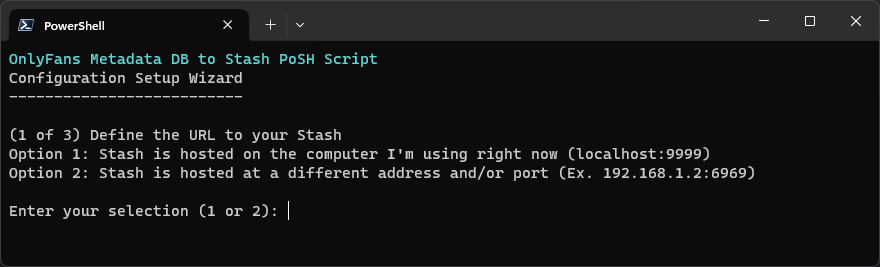

<h1 align="center">OnlyFans Metadata to Stash Powershell Script</h1>

**OFMetadataToStash** is an OnlyFans metadata import tool for Stash, written in Powershell.

* Simple to use with a straightforward command line based UI!
* Script can auto-associate scenes/images with the appropriate OnlyFans performer(s) and studio, in batch!
* Built-in utility for completely scrubbing and sanitizing OnlyFans metadata databases
  

## 🍦 How it Works
- This script primarily relies on the SQLIte files (`user_data.db`) that a OnlyFans scraper generates. These files contain all the metadata you might want!
- This script does **not** access/scrape/download/or otherwise pull down metadata from OnlyFans or any other service.
- That said, if you don't have metadata DB files, this script _can_ try and make a good guess as your performers and associated content based on file path

## 💻 Requirements
- Stash v0.24.3 ([Released 2024-1-14](https://github.com/stashapp/stash/releases/))
- Any major operating system (Windows/macOS/Linux) running [Microsoft Powershell](https://learn.microsoft.com/en-us/powershell/scripting/install/installing-powershell?view=powershell-7.3)

## 📖 How to Run

1. Ensure the latest version of [Microsoft Powershell](https://learn.microsoft.com/en-us/powershell/scripting/install/installing-powershell?view=powershell-7.3) is installed. 
2. Open a Powershell prompt in the same directory as the script and run the command `.\OFMetadataToStash.ps1` to start its short configuration wizard

## 🚩 Command Line Flags
- `-ignorehistory` Script won't skip over metadata databases have already been imported to your Stash.
- `-randomavatar` Script will ignore the use of the profile image that a particular performer selected for themselves.
- `-v` Script will be more verbose with its output while running. Useful for troubleshooting.

## 📌 Additional Notes
- This script makes use of the excellent [PSSQLite](https://github.com/RamblingCookieMonster/PSSQLite) and [PSGraphQL](https://www.powershellgallery.com/packages/PSGraphQL/1.6.0) PowerShell modules. Kudos to those developers!
